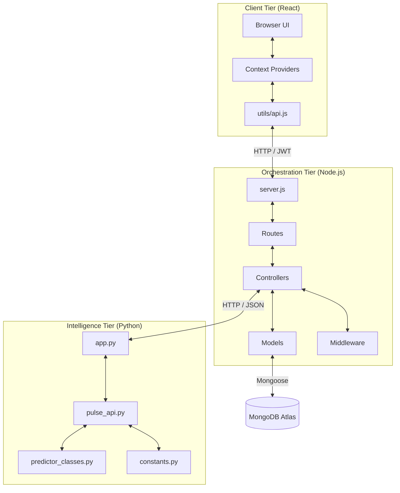

# Pulse Intelligence System: Master Architecture Map

This document serves as the definitive guide to the Pulse project's architecture, file connectivity, and data flow. It explains how the three primary services (Frontend, Backend, and ML Engine) work in unison to provide real-time productivity insights.

---

## 1. High-Level System Architecture

Pulse follows a **Triple-Tier Microservice Architecture**. 

---

## 2. Component Directory Breakdown

### 🎨 Frontend: The Interface (`client/src`)
| Directory / File | Connection Point | Role |
| :--- | :--- | :--- |
| `App.jsx` | `routes/` (Backend) | Master Router. Maps URLs to Page components. |
| `context/` | All Pages | Global state management (Authentication & Timer status). |
| `pages/Dashboard.jsx` | `api.js` | Main entry point for viewing ML-generated results. |
| `utils/api.js` | `server.js` | Centralized Axios instance that injects JWT tokens into every request. |

### ⚙️ Backend: The Orchestrator (Root)
| Directory / File | Connection Point | Role |
| :--- | :--- | :--- |
| `server.js` | All Endpoints | Entry point for the Node server. Binds middleware and mounts routes. |
| `routes/` | `controllers/` | Entry points for URL requests (e.g., `/api/logs`). |
| `controllers/` | `models/` & `ML API` | Business logic. Handles DB writes and talks to the Python engine. |
| `models/` | `MongoDB` | Mongoose schemas for User data, Logs, and Predictions. |
| `middleware/auth.js` | `controllers/` | Intercepts requests to verify JWT before allowing logic to run. |

### 🧠 ML Engine: The Brain (`ml_api`)
| Directory / File | Connection Point | Role |
| :--- | :--- | :--- |
| `app.py` | `controllers/` | Flask entry point. Exposes the `/predict` endpoint. |
| `pulse_api.py` | `app.py` | Functional orchestrator. Combines models and applies heuristics. |
| `predictor_classes.py`| `pulse_api.py` | Specific ML logic for Productivity, Burnout, and Personas. |
| `constants.py` | All ML Files | Global averages and feature weighting (The Synergy Engine). |

---

## 3. The "Request Lifecycle" (Data Flow)

To understand how files are connected, trace a single **Daily Log Submission**:

1.  **Trigger**: User clicks "Submit Log" on [DailyLog.jsx](file:///c:/Users/Ravin/OneDrive/Desktop/pulse/client/src/pages/DailyLog.jsx).
2.  **API Call**: Data is sent via [api.js](file:///c:/Users/Ravin/OneDrive/Desktop/pulse/client/src/utils/api.js) to the `POST /api/logs` route.
3.  **Routing**: [logRoutes.js](file:///c:/Users/Ravin/OneDrive/Desktop/pulse/routes/logRoutes.js) identifies the path and passes it to the `createLog` controller.
4.  **Auth Check**: [auth.js](file:///c:/Users/Ravin/OneDrive/Desktop/pulse/middleware/auth.js) verifies the user's identity before the controller starts work.
5.  **Logic & DB**: [logController.js](file:///c:/Users/Ravin/OneDrive/Desktop/pulse/controllers/logController.js) creates a entry in **MongoDB** using [DailyLog.js](file:///c:/Users/Ravin/OneDrive/Desktop/pulse/models/DailyLog.js).
6.  **ML Inference**: The controller sends the metrics to the **Flask ML API** at `/predict`.
7.  **Intelligence Model**: [app.py](file:///c:/Users/Ravin/OneDrive/Desktop/pulse/ml_api/app.py) runs the metrics through [pulse_api.py](file:///c:/Users/Ravin/OneDrive/Desktop/pulse/ml_api/pulse_api.py) and calculates the result.
8.  **Sync & Return**: Node receives the prediction, saves it to the `Predictions` collection, and returns the combined data to the **Frontend Dashboard**.

---

## 4. Multi-Service Communication Summary

The system relies on three critical communication links:

1.  **UI ➔ API (JWT Secured)**: All frontend components use the centralized `api.js` utility. If you change a route in the backend, you must update the call in `api.js`.
2.  **API ➔ ML (JSON Driven)**: The Node.js backend acts as a translator, turning Mongoose objects into clean JSON payloads for the Python Flask service.
3.  **API ➔ Database (ORM Driven)**: All data persistence is handled via Mongoose models. Changing a field in a model (like `User.js`) requires updating both the Frontend form and the ML feature list.

---

> [!TIP]
> **Pro Tip**: To add a new feature that impacts the Pulse Score, start at the **ML Engine** level (`constants.py`), move down to the **Database Model** (`models/`), and finally update the **Frontend Page** (`DailyLog.jsx`).
