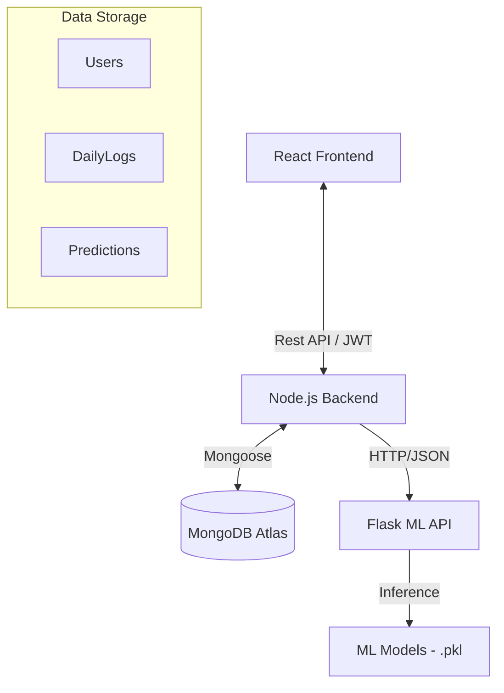

# 🧠 PULSE — Personal Performance Intelligence System

> **Comprehensive Technical Documentation v2.0**
> 
> 📘 **[NEW] MASTER ARCHITECTURE MAP**: For a full-stack connectivity diagram, detailed file structure breakdown, and request lifecycle trace, please see **[MASTER_ARCHITECTURE_MAP.md](file:///c:/Users/Ravin/OneDrive/Desktop/pulse/MASTER_ARCHITECTURE_MAP.md)**.

---

## 1. Executive Summary

**PULSE** is a state-of-the-art Personal Performance Intelligence System designed to bridge the gap between subjective daily effort and objective productivity metrics. By integrating high-fidelity user activity logging with multi-modal Machine Learning, PULSE transforms raw behavioral data into actionable cognitive insights.

The platform addresses the "productivity-burnout paradox" by providing users with structured feedback on their efficiency while monitoring high-risk indicators of burnout. Technically, PULSE is built on a distributed **4-layer architecture**: a responsive **React** frontend, a scalable **Node.js/Express** orchestration layer, a specialized **Flask ML API**, and a **MongoDB** document store.

The system's core intelligence resides in its **3-Model ML Ensemble**, which utilizes Linear Regression for performance scoring, Logistic Regression for risk classification, and K-Means Clustering for behavioral persona mapping. With automated focus features derived from real-time timer behavior, PULSE offers an unprecedented level of granularity in personal analytics.

---

## 2. Project Overview

### The Problem
Traditional productivity trackers often rely on simple task completion lists, which fail to account for cognitive load, focus quality, or emotional wellbeing. This leads to "toxic productivity," where users chase high output at the cost of impending burnout.

### Key Features
| Feature | Description |
| :--- | :--- |
| **Productivity Score** | A 0-100 real-time index calculated via Linear Regression using 13+ behavioral inputs. |
| **Burnout Risk** | A probability-based classification (Low, Medium, High) predicting mental exhaustion. |
| **Persona Engine** | Unsupervised K-Means clustering that maps users into lifestyle profiles (e.g., "High Performer", "Under Pressure"). |
| **Focus Timer** | A Pomodoro-style utility that auto-synthesizes session duration and quality into the ML pipeline. |
| **Peer Benchmark** | A percentile-based comparison allowing users to see how they perform against anonymous peers in their persona cluster. |

### Tech Stack Summary
| Layer | Technology | Purpose |
| :--- | :--- | :--- |
| **Frontend** | React, Vite, Framer Motion, Recharts | UI/UX, Animations, & Data Visualization |
| **Backend** | Node.js, Express, JWT, Axios | API Gateway, Auth, & Service Orchestration |
| **ML Engine** | Python, Flask, Scikit-Learn, Pandas | Model Inference, Feature Scaling, & Explainer Engine |
| **Database** | MongoDB Atlas, Mongoose | Persistent Document Store for Logs & Predictions |

---

## 3. System Architecture

The PULSE architecture is designed for modularity and separation of concerns.

### System Diagram


### Data Flow Logic
1.  **User Logs Data**: The user submits their daily metrics through the React UI.
2.  **Storage**: The Node.js backend receives the request, attaches the user ID, and saves the `DailyLog` to MongoDB.
3.  **Inference Request**: Node.js immediately forwards the payload (log data + derived focus features) to the Flask ML API.
4.  **Prediction**: Flask loads serialized Scikit-Learn models, performs feature scaling, and returns a JSON object containing scores, risks, and personas.
5.  **Persistence**: Node.js saves the result into the `Predictions` collection and returns it to the frontend.
6.  **Visualization**: The Dashboard renders charts and benchmark cards based on this cycle.

### Focus Timer Integration
Unlike daily logs, focus sessions are captured in real-time. When a session ends:
- A `POST /api/logs/focus` request is sent.
- Node.js updates/upserts a log for the current day.
- Focus features (`focus_duration_mins`, `focus_quality_score`, `distraction_level_encoded`) are auto-calculated and passed to the ML engine for an immediate score update.

---

## 4. Complete File & Folder Structure

```text
/pulse
├── PULSE_ML_Pipeline.ipynb     # Model training and pipeline definition (OOP)
├── pulse_dataset.csv           # Base synthetic dataset (100k records)
├── pulse_models/               # Serialized .pkl models and scalers
├── server.js                   # Node.js entry point
├── controllers/                # Backend logic (Auth, Logs, Predictions, Reports, Benchmark)
├── models/                     # Mongoose Schemas (User, DailyLog, Prediction)
├── routes/                     # Express route definitions
├── middleware/                 # JWT Authentication and Error Handling
├── ml_api/                     # Flask ML Inference Service
│   ├── app.py                  # Flask entry point & endpoints
│   ├── pulse_api.py            # Main API orchestration class
│   ├── predictor_classes.py    # Inference logic for all 3 models
│   └── constants.py            # Global averages and feature lists
└── client/                     # React / Vite SPA
    ├── src/
    │   ├── context/            # Auth and Timer state management
    │   ├── pages/              # Main view components
    │   └── components/         # Reusable UI modules (Charts, Cards, Nav)
```

### Key File Explanations

| File | Role | Exports/Exposes |
| :--- | :--- | :--- |
| `pulse_api.py` | Orchestrates inference across models. | `PulseAPI` class with `predict_all()` method. |
| `logController.js` | Handles CRUD for logs and ML API calls. | Endpoints for `/api/logs` and `/api/logs/focus`. |
| `Dashboard.jsx` | Main user landing page. | Aggregated views for latest prediction and summary reports. |
| `User.js` | MongoDB User model. | Defines schema for auth, personas, and onboarding status. |

---

## 5. Dataset Documentation

### Synthetic Data Origin
The `pulse_dataset.csv` is a **synthetic, pre-collected dataset** containing 100,000 behavioral records across 500 unique users. It was generated using correlations derived from academic studies on high-stress environments to ensure the ML models encounter realistic patterns between sleep deprivation, excessive screen time, and high burnout risk.

### Feature Schema (20 Columns)
| Column | Type | Range | Description |
| :--- | :--- | :--- | :--- |
| `user_id` | Int | - | Unique identifier for the user. |
| `persona` | Categorical | 4 types | Seed persona from dataset generation. |
| `sleep_hours` | Float | 0-24 | Total sleep duration. |
| `study_hours` | Float | 0-24 | Time spent in deep work/study. |
| `screen_time_hours` | Float | 0-24 | Digital exposure duration. |
| `exercise_mins` | Int | 0-1440 | Physical activity level. |
| `mood_score` | Int | 1-5 | Subjective wellbeing score. |
| `stress_level` | Int | 1-5 | Subjective pressure level. |
| `caffeine_intake` | Int | 0-10 | Number of caffeinated beverages. |
| `water_litres` | Float | 0-10 | Hydration level. |
| `deep_focus_blocks` | Int | 0-10 | Number of 25-min focus sessions. |
| `social_media_mins` | Int | 0-1440 | Passive digital consumption. |
| `productivity_score` | Float | 0-100 | Target variable for regression. |
| `burnout_risk` | Categorical | L/M/H | Target variable for classification. |
| `focus_duration_mins`* | Int | 0+ | **Derived:** Aggregated from Timer behavior. |
| `focus_quality_score`* | Float | 1-5 | **Derived:** Average session quality rating. |
| `distraction_level_encoded`* | Int | 0-2 | **Derived:** (None: 0, Mild: 1, Heavy: 2). |
| `day_of_week` | String | Mon-Sun | Name of the logging day. |
| `is_weekend` | Int | 0-1 | Binary flag (1 for Saturday/Sunday). |

*\* denotes features dynamically synthesized by the PULSE application at runtime.*

---

## 6. ML Pipeline Documentation

The pipeline is implemented using an Object-Oriented (OOP) approach in `PULSE_ML_Pipeline.ipynb`.

### OOP Components
- **DataLoader**: Optimized loader for `pulse_dataset.csv`. Handles feature selection and initial encoding.
- **ProductivityPredictor**: A **Multiple Linear Regression** model. It uses the `CORE_FEATURES` set and returns a continuous score. Evaluation metrics include R² (goodness of fit) and RMSE.
- **BurnoutClassifier**: A **Logistic Regression** model using expanded features including temporal context (`day_of_week`). Returns probability distributions across "Low", "Medium", and "High" risk classes.
- **PersonaEngine**: An unsupervised **K-Means Clustering** model (k=4). Clusters are labeled based on multidimensional centroid analysis: *Balanced, High Performer, Under Pressure, Restricted Sleep*.
- **PulseExplainer**: Translates model weights into user-friendly insights (e.g., identifies "Study Hours" as a top positive driver).

---

## 7. Flask ML API Documentation

The ML API acts as a stateless microservice for high-speed inference.

### PulseAPI Class
Manages the lifecycle of 8 serialized model files (`.pkl`). It performs real-time data transformation and filling of missing values using global dataset averages.

### Endpoints
#### `POST /predict`
**Request Body:**
```json
{
  "sleep_hours": 7.5,
  "study_hours": 6.0,
  "mood_score": 4,
  "focus_duration_mins": 120
}
```
**Response Schema:**
```json
{
  "success": true,
  "data": {
    "productivity_score": 82.5,
    "burnout_risk": "Low",
    "burnout_confidence_scores": { "Low": 0.85, "Medium": 0.12, "High": 0.03 },
    "persona": "High Performer",
    "top_positive_factors": ["Study Sessions", "Mood"],
    "top_negative_factors": []
  }
}
```

#### `GET /health`
Validates model connectivity and system uptime.

---

## 8. Node.js Backend Documentation

### API Routes & Orchestration
All core routes are secured via JWT. The client must provide a valid `Authorization` header.

| Method | Route | Auth | Description |
| :--- | :--- | :--- | :--- |
| `POST` | `/api/auth/login` | No | Authenticate and obtain JWT. |
| `POST` | `/api/logs` | Yes | Submit metric audits. |
| `POST` | `/api/logs/focus` | Yes | Finalize focus timer session. |
| `GET` | `/api/predictions/latest`| Yes | Fetch most recent intelligence report. |
| `GET` | `/api/benchmark` | Yes | Get Persona-based percentile rankings. |

### Environment Variables
| Variable | Description | Default |
| :--- | :--- | :--- |
| `MONGO_URI` | Connection for MongoDB. | *Required* |
| `JWT_SECRET` | Secret sign-key. | *Required* |
| `FLASK_API_URL`| Internal Link to ML API. | `http://localhost:5000/predict` |

---

## 9. MongoDB Schema Documentation

### Core Collections

#### 1. `users`
- Stores name, hashed password, and persistent persona type.
- Unique index on `email`.

#### 2. `dailylogs`
- Stores behavioral metrics link to specific users via `userId` (ObjectId).
- Includes derived focus features for ML synchronization.
- Composite index on `userId` + `date` for optimized lookup.

#### 3. `predictions`
- Acts as a snapshot of ML output for a specific log.
- Stores productivity scores, risk categorizations, and peer percentiles.
- Enforces a 1:1 `logId` mapping to prevent duplicate audits.

---

## 10. Frontend Documentation

### UX Architecture
- **Glassmorphism Design**: Dashboard utilizes high-contrast cards with subtle blurs and shadows for a premium, modern feel.
- **Dynamic Scoring**: Score rings animate in real-time using Framer Motion based on ML API results.

### Frontend Logic
- **Auth Flow**: Managed via `AuthContext`, handling token persistence in `localStorage` and attaching it to all Axios requests.
- **Focus Timer**: State lives in `TimerContext`. It captures session quality and auto-dispatches data to `/api/logs/focus` upon completion, ensuring zero-input tracking.
- **Benchmark Card**: Calculates the visual progress bars by comparing user metrics against the aggregate of their specific persona cluster.

---

## 11. How to Run Locally

Start the entire system for local development in three easy steps:

### Step 1: Install Dependencies
```bash
# In the root project folder
npm install

# In the React folder
cd client && npm install
```

### Step 2: Set Up Python ML API
```bash
cd ml_api
# It is recommended to use a virtual environment
python -m venv venv
# Windows: venv\Scripts\activate | MacOS: source venv/bin/activate
pip install -r requirements.txt
python app.py
```

### Step 3: Configure and Start
1. Create a `.env` in the root:
```env
MONGO_URI=your_mongodb_uri
JWT_SECRET=pulse_secret_key
FLASK_API_URL=http://localhost:5000/predict
```
2. Start the Backend: `npm run dev` (from root).
3. Start the Frontend: `npm run dev` (from /client).

---

## 12. Deployment Guide

### ML API & Backend (Render)
- **Runtime**: Python 3.9+ for ML, Node.js 18+ for Backend.
- **Build Commands**: Standard `pip install` and `npm install`.
- **Note**: Link services using internal URLs or environment variables on the Render Dashboard.

### Frontend (Vercel)
- Set root directory to `client`.
- Add `VITE_API_URL` pointing to your deployed backend.

---
*PULSE — Elevate Your Cognitive Performance.*
