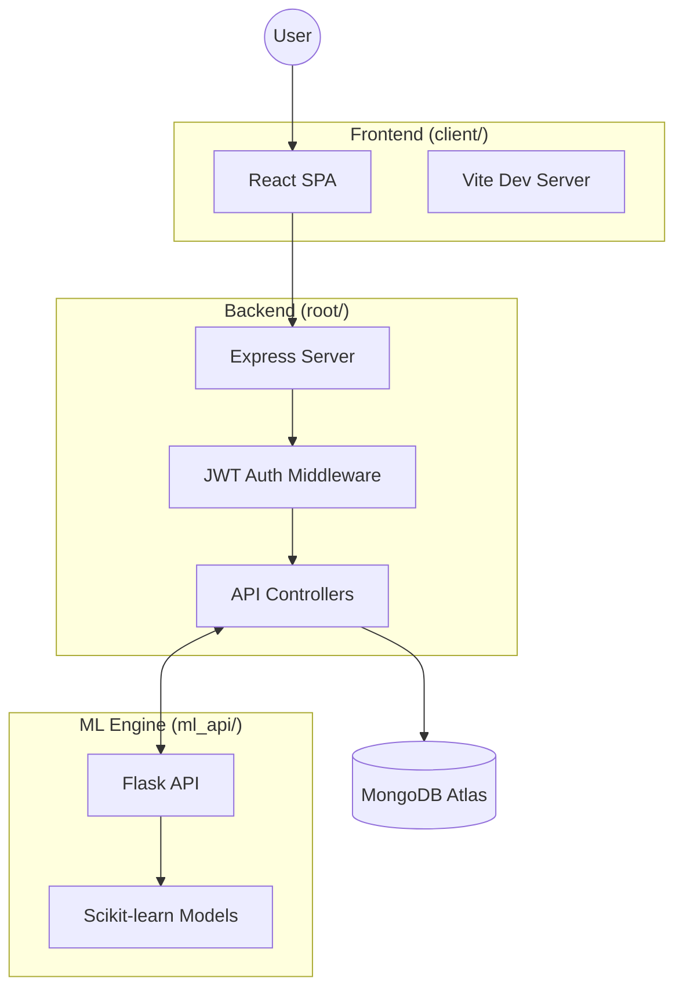

# Technical Architecture & System Design

This document provides a deep dive into the underlying architecture of Pulse, detailing how the different components communicate and handle data.

## 🏗️ High-Level System Design

Pulse follows a **multi-tier architecture** with three primary services:

1.  **Frontend (React/Vite)**: A single-page application (SPA) focused on user experience and real-time visualization.
2.  **Backend (Node.js/Express)**: Orchestrates authentication, database operations, and proxying to the ML service.
3.  **ML Engine (Flask)**: A specialized microservice responsible for processing raw user data through trained machine learning models.

## 🛠️ Service Breakdown

### 1. The Frontend (`/client`)
Built with modern React (v19) and Vite.
*   **Context API**: Used for global state management (Authentication and Timer state).
*   **Tailwind CSS**: Utility-first styling with custom glassmorphism components.
*   **Recharts**: SVG-based visualization for productivity and burnout trends.
*   **Framer Motion**: Smooth transitions and entry animations for the dashboard.

### 2. The API Server (Root)
Built with Express.js (v5), focusing on security and speed.
*   **Security**: Implements `helmet`, `express-rate-limit`, and `express-mongo-sanitize`.
*   **JWT Authentication**: Ensures all focus sessions and metrics are private to the user.
*   **Proxy Pattern**: The backend acts as a bridge to the ML Engine, ensuring the frontend only needs to connect to a single API origin.

### 3. The ML Engine (`/ml_api`)
A sidecar Flask service that provides intelligence.
*   **`pulse_api.py`**: The interface that loads trained models and scalers.
*   **Prediction Model**: Regressor predicting a `0-100` productivity score.
*   **Burnout Classifier**: Multi-class classifier (None, Mild, Heavy) assessing risk.
*   **Persona Engine**: Clustering model that assigns a focus "type" (e.g., Deep Focus Expert, Fragmented Thinker).

## 📊 Data Life Cycle

1.  **Input**: User completes a Focus Timer session or a Daily Ritual log.
2.  **Processing**: Backend saves raw data to MongoDB.
3.  **Intelligence**: Backend prepares a feature vector and sends it to the Flask ML Service.
4.  **Insight**: Flask returns prediction data which is stored alongside the log entry.
5.  **Output**: Frontend retrieves historical data and renders the Performance Indices.
